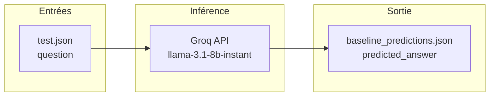
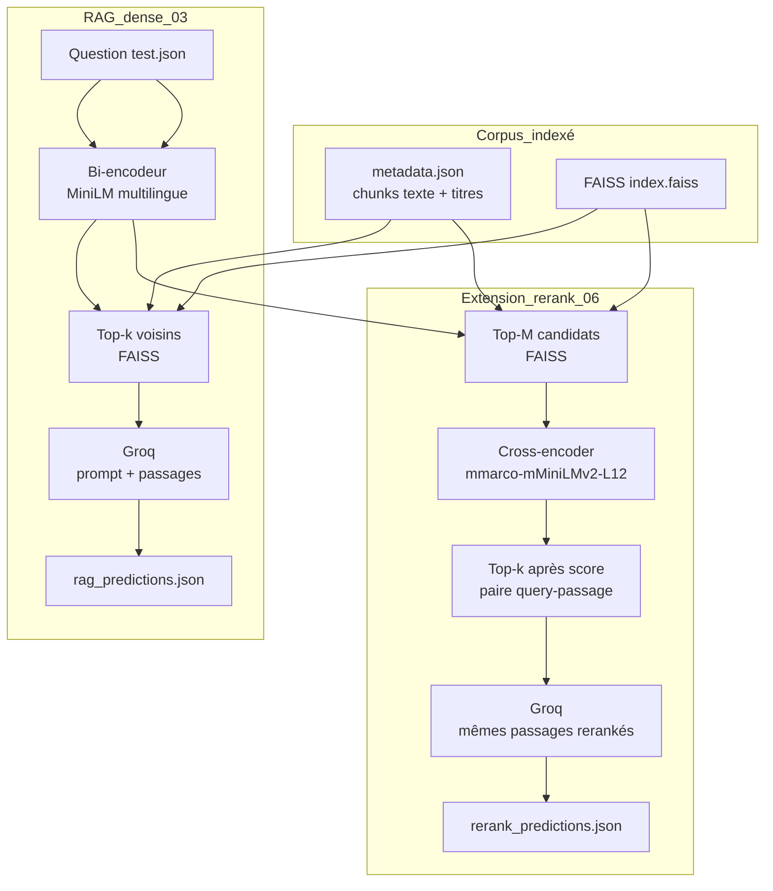
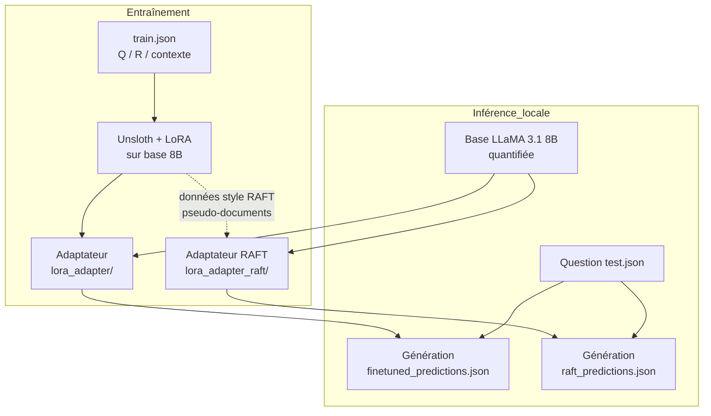
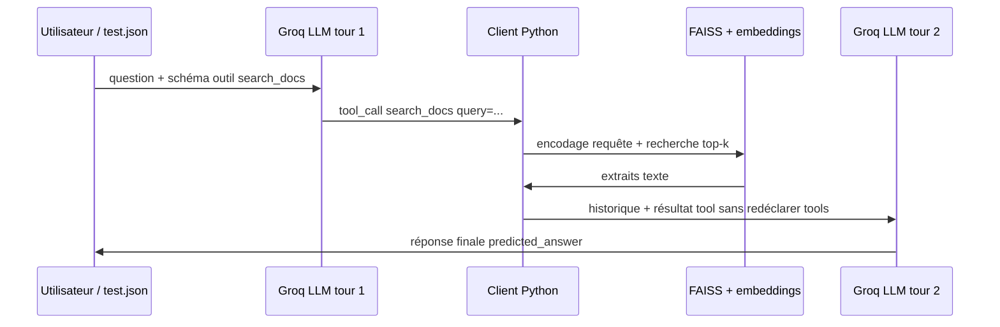
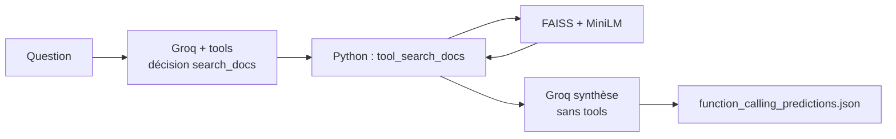

# Schémas des quatre paradigmes d’intégration d’information

Document autonome pour le projet **Article_scientifique** : corpus français (Option B), base génératrice **LLaMA 3.1 8B** alignée sur **`llama-3.1-8b-instant`** (Groq) pour les méthodes API, modèle quantifié + adaptateurs **LoRA** (Unsloth) pour l’adaptation locale.

Les **six** pipelines du README se regroupent ici en **quatre schémas** : le **RAG + reranking** apparaît comme extension du RAG ; le **RAFT** comme variante d’entraînement du schéma LoRA.

---

## 1. Baseline (sans récupération)

**Notebook :** `03_baseline_rag.ipynb` (branche baseline)  
**Entrée :** `data/processed/test.json` (question seule)  
**Sortie :** `results/baseline_predictions.json`

**Idée :** aucun passage documentaire ; le modèle ne s’appuie que sur ses poids figés (cut-off connu).

---

## 2. RAG dense (+ extension reranking)

**Notebooks :** `03_baseline_rag.ipynb` (RAG) · `06_rag_rerank.ipynb` (rerank)  
**Index :** `models/faiss_index/` (`index.faiss`, `metadata.json`)  
**Embeddings :** `sentence-transformers/paraphrase-multilingual-MiniLM-L12-v2`  
**Sorties :** `results/rag_predictions.json` · `results/rerank_predictions.json`

**Idée :** le RAG injecte des extraits récupérés **à l’inférence** ; le rerank **re-classe** les passages avant génération pour réduire le bruit du retrieval dense.

---

## 3. Fine-tuning LoRA (+ variante RAFT)

**Notebooks :** `04_finetuning.ipynb` (LoRA standard) · `05_raft.ipynb` (RAFT)  
**Entrée train :** `data/processed/train.json`  
**Sorties modèles :** `models/lora_adapter/` · `models/lora_adapter_raft/`  
**Inférence :** locale (Unsloth + base quantifiée LLaMA 3.1 8B)  
**Sorties prédictions :** `results/finetuned_predictions.json` · `results/raft_predictions.json`

**Idée :** les connaissances cibles sont **incorporées dans les poids** (adaptateurs) plutôt que rappelées par index ; le **RAFT** entraîne avec des contextes proches du train pour imiter un comportement RAG au moment de l’entraînement.

---

## 4. Function calling (outil de recherche)

**Notebook :** `07_function_calling.ipynb`  
**Même index que le RAG :** FAISS + `metadata.json` + bi-encodeur  
**Sortie :** `results/function_calling_predictions.json`

**Équivalent flux batch (vue pipeline) :**

**Idée :** le modèle **décide** (en théorie) quand lancer une recherche et avec quelle requête ; l’exécution reste **côté Python** comme pour le RAG, mais le contrôle est **structuré** (appel d’outil) plutôt qu’un prompt unique « passages collés ».

---

## Tableau de correspondance rapide

| Schéma | Fichiers / artefacts clés | Rôle du corpus à l’inférence |
|--------|---------------------------|------------------------------|
| 1. Baseline | Groq seul | Aucun |
| 2. RAG (+ rerank) | FAISS, metadata, Groq | Passages récupérés (dense puis optionnellement rerankés) |
| 3. LoRA / RAFT | train.json, adaptateurs | Optionnel selon protocole (souvent question seule en éval) |
| 4. Function calling | FAISS + outil `search_docs` | Passages après décision d’outil |

Pour l’**agrégation des métriques** sur l’ensemble des stratégies (y compris les six du README), utiliser **`08_evaluation.ipynb`** et les JSON `*_predictions.json` dans `results/`.
